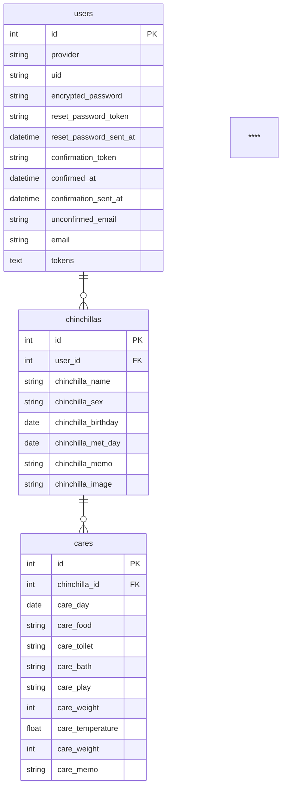

# ちらろぐ / チンチラ専用のお世話記録サービス

## サービス概要
「ちらろぐ」は、チンチラをこよなく愛する開発者が作った、無料で利用できるチンチラ専用のお世話記録サービスです。
シンプルなサイトデザインと直感的なUIで、誰でも簡単に毎日のお世話が記録できます。

### サービスURL
https://www.chillalog.com
レスポンシブ対応済のため、PCだけでなくスマートフォンやタブレットでも快適にご利用いただけます。

### 開発背景
私自身もチンチラを飼っており、日々のお世話を記録していましたが、多くのサービスが犬・ネコ用に作られているため、「砂浴び」や「部屋んぽ」といったチンチラならではのカテゴリがなく、自分で作成しないといけないことに不便を感じていました。
また、餌の種類や量、おしっこやうんちの状態といった様々な項目を手入力しないといけないサービスが多く、面倒になってしまいなかなかお世話を記録する習慣が身につきませんでした。
そこで、「チンチラ専用」「手入力は最小限」のお世話記録サービスを自分で作ってしまおうと思い、「ちらろぐ」を開発しました。

## メイン機能の使い方

## 使用技術一覧
フロントエンド: React 18.2.0 / Next.js 13.4.12
- コード解析: ESLint / Markuplint
- フォーマッター: Prettier
- CSSライブラリ / フレームワーク: Tailwind CSS / daisyUI / shadcn/ui
- 主要ライブラリ: Axios / React Hook Form / zod / React number format / date-fns / clsx / Font Awesome / Recharts

バックエンド: Ruby 3.2.2 / Ruby on Rails 7.0.6
- コード解析 / フォーマッター: Rubocop
- 主要ライブラリ: Devise / Devise Token Auth / Carrierwave / fog-aws

インフラ: Vercel / AWS (Route 53 / ACM / ALB / VPC / ECR / ECS Fargate / RDS for MySQL / S3 / SSM)

環境構築: Docker / Docker Compose

## 主要機能一覧
### ユーザー向け
**機能**
- メールアドレスとパスワードを利用したユーザー登録 / ログイン機能
- ユーザー情報変更機能
- パスワード再設定機能
- 退会機能
- チンチラの作成 / 取得 / 更新 / 削除機能
- お世話の記録の作成 / 取得 / 更新 / 削除機能
- 体重のグラフ表示 / 平均体重表示機能
- 画像の取得 / アップロード機能

**画面**
- カルーセル
- ローディング画面
- モーダル画面
- レスポンシブデザイン

### 非ユーザー向け
システム / インフラ
- Dockerによる開発環境のコンテナ化
- 独自ドメイン + SSL化

クロスブラウザテスト
- PC
  - Windows10 / 11: Google Chrome / Firefox / Microsoft Edge
  - Mac: Google Chrome / Firefox / Safari
- タブレット
  - iPad: Google Chrome / Safari
- スマートフォン
  - Android: Google Chrome
  - iOS: Google Chrome / Safari

## インフラ構成図

## ER図

## 画面遷移図